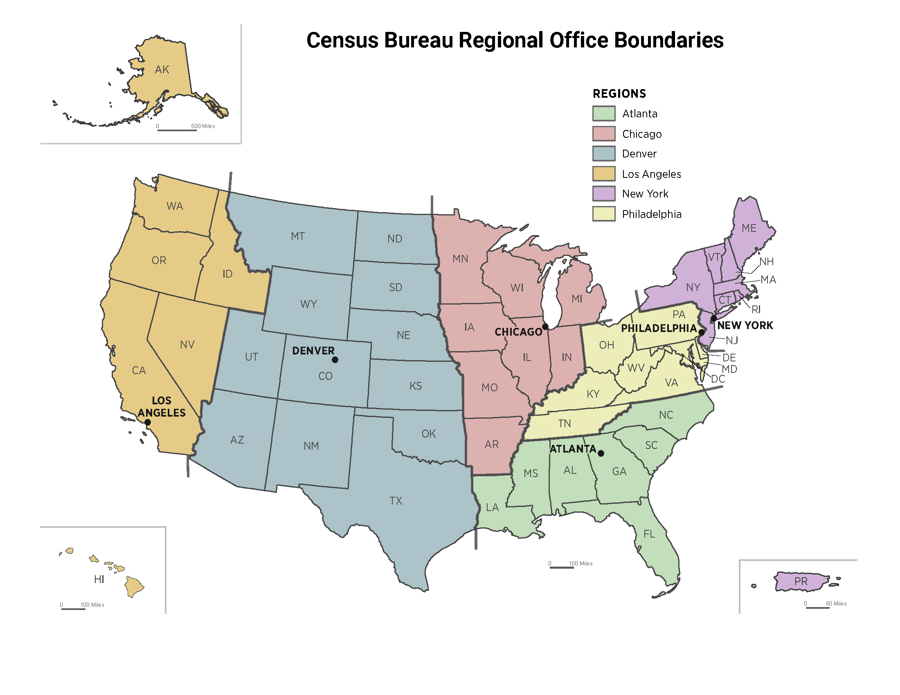

:::::::::::::::::::::::::::::::::::::: questions 

- What are the kinds of datasets available from the U.S. Census Bureau?
- How can you visualize and analyze these datasets for your region of interest?
- How do you combine spatial and tabular data from the Census Bureau?
- What are the variables in the ACS dataset?

::::::::::::::::::::::::::::::::::::::::::::::::

::::::::::::::::::::::::::::::::::::: objectives

- Provide an overview of the data available from the U.S. Census Bureau
- Explain how to download and visualize spatial data from the Census Bureau
- Demonstrate how to query and analyze the spatial data
- Demonstrate how to perform complex spatial joins

::::::::::::::::::::::::::::::::::::::::::::::::

## Introduction

There are three broad categories of datasets available from the U.S. Census Bureau:

1. Census TIGER/Line Shapefiles
2. Decennial Census of Population and Housing
3. American Community Survey (ACS)

### Census TIGER/Line Shapefiles

TIGER (Topologically Integrated Geographic Encoding and Referencing) system. It is the primary geospatial data provided by Census Bureau. 
TIGER/Line shapefiles are available from 2007 to present. Data before 2007 are available in ASCII format. 
It includes all legal boundaries and names of different geographic units in United States, including states, counties, places, zip codes, urban areas, census blocks, census block groups, and census tracts. 
These shapefiles include a standard geographic identifier (GEOID) for each record which links to the GEOID in the census data.
TIGER/Line Shapefiles use the American National Standards Institute (ANSI) codes to identify geographic entities. 
The ANSI include both the Federal Information Processing Series (FIPS) codes and the U.S. Geological Survey’s Geographic Names Information System (GNIS) codes. 
The fields in the shapefiles include these information. For example, “STATEFP” filed means state FIPS code, and “STATENS” field means state GNIS code. 
County level FIPS codes usually have five digits. The first two are the FIPS code of the state to which the county belongs and the rest three are county codes.

### Decennial Census of Population and Housing

It is conducted every ten years which counts every person living in the U.S. 
It provides general population characteristics such as age, sex, race, ethnicity, and household composition. 
It is a point-in-time data which sample every person with smallest margin of error.

Variables:

- Population data by sex, age, race, Hispanic origin and more. 
- Housing data by occupancy, vacancy status, and tenure at the highest geographic resolution (all levels).

### American Community Survey (ACS)

ACS is conducted every year by collecting information from a sample population. 
It includes topics not included in the decennial census such as education, employment, internet access, and transportation. 
ACS 1-year estimate is based on 12-month continuous survey and ACS 5-year estimate is based on a 60-month continuous survey. 
Compared to decennial census data, ACS survey information has relatively high margin of error (i.e. less reliable estimates).

Variables:
In addition to demographic and housing data, ACS also include:

1. Social characteristics
- school enrollment
- educational attainment
- marital status
- fertility
- grandparents caring for children
- veteran status
- disability status
- language spoken at home
2. Income and benefits
- food Stamps/Supplemental Nutrition Assistance Program (SNAP)
- health insurance coverage
- income
3. Employment
- employment location
- mode of travel to work
4. Many other variables
- ancestry
- citizenship status
- place of birth
- year of entry

::::::::::::::::::::::::::::::::::::: keypoints 

- Census data can be used for planning services for certain population groups
- It can be used for site selection for new businesses or service facilities
- Public policy analysis
- Spatial analysis of hazard impact, epidemiological models, etc.

::::::::::::::::::::::::::::::::::::::::::::::::

## Accessing the Census Data 

Before we can map or analyze census data spatially, we must first **obtain the data**.
The U.S. Census Bureau provides multiple ways to download data, including:

- Manual downloads from data.census.gov  
- Bulk file downloads  
- Programmatic access through official Census APIs  

In this lesson, we introduce **API-based census data access**, which allows users to
retrieve demographic and socioeconomic data directly into Python workflows.

### What Does “API-Based Census Access” Mean?

An API (Application Programming Interface) allows computers to request data directly
from a server using structured URLs. Instead of clicking through a web interface,
API calls return machine-readable data (e.g., JSON or CSV) that can be processed
automatically.

Using Census APIs, we can:

- Specify exactly **which variables** we want  
- Choose the **geographic scale** (state, county, tract, block group)  
- Automate downloads for reproducibility  
- Integrate census data directly into scripts and analyses  

This approach is especially useful for research, teaching, and large-scale analysis.

### How This Differs from Geocoding

| Census API Data Access | Geocoding |
|---|---|
| Downloads official census tables | Converts addresses → coordinates |
| Uses predefined census geographies | Uses external location services |
| Returns demographic attributes | Returns spatial point locations |
| Designed for aggregation | Designed for individual locations |
| Emphasizes consistency | Emphasizes positional accuracy |

In this notebook, we **do not geocode addresses**.  
Instead, we retrieve **attribute data that is already organized by census geography**.

### Why Use Census APIs Instead of Manual Downloads?

Researchers prefer APIs because they:

- Reduce manual steps and human error  
- Ensure **reproducibility** of results  
- Make workflows scalable and automatable  
- Allow direct integration with Python and GIS tools  
- Support consistent data retrieval across years  

For example, the same API query can be reused to:
- Update data annually
- Change geographic extent
- Swap variables without re-downloading files

### Typical Census API Workflow

1. Construct a request URL specifying variables and geography  
2. Send the request to the Census API endpoint  
3. Receive structured data (JSON or CSV)  
4. Convert results into a DataFrame  
5. Join data with geographic boundaries later (optional)  

At this stage, the data is **tabular**, not spatial — but ready to become spatial
through joins with census boundary files or mapping tools.

::::::::::::::::::::::::::::::::::::: callout

**Important**

Census APIs return **aggregate data only**.  
Individual-level records are never provided, ensuring privacy protection.

::::::::::::::::::::::::::::::::::::::::::::::::

### When to Use Census APIs

Use Census APIs when:

- You need demographic or socioeconomic variables
- You want official, authoritative data
- Reproducibility is important
- You plan to analyze multiple regions or years
- Data will later be joined to spatial boundaries

This API-based approach forms the **foundation** for spatial census analysis,
which we will build on in the remainder of this lesson.

## Expert Tutorial: Accessing ACS Data via the Census API

### Step 1 - Explore the Census API

1. Go to [Census Developers Page](https://www.census.gov/data/developers.html).
2. Select **Available APIs** (left side of the search bar).
3. Scroll down and click on the desired API dataset. For this tutorial, we choose **American Community Survey (ACS)**.
4. The ACS offers multiple products — **1-year**, **3-year**, and **5-year estimates**.  
   - 5-year data provides a longer time frame.  
   - For example:  
     - **2023 ACS 5-Year** covers 2019–2023.  
     - **2022 ACS 5-Year** covers 2018–2022.  
   - We will use **2023**.
5. Scroll to **Data Profiles** and review the “Example Call” links — these are the base API URLs used in Python or directly in a browser.
6. Under **Data Profiles**, click the `html` link next to **2023 ACS Comparison Profiles Variables**. This page lists all available variables and their codes. 

 
### Step 2 - Understanding API Links for Geographic Levels 

The ACS API provides different base links for:
- **Country**
- **State**
- **Tract within a state**

For tract-level data, use the “state > county > tract” pattern.

Example base link for California (state code `06`): 

`https://api.census.gov/data/2023/acs/acs5/profile?get=NAME&for=tract:*&in=state:06&in=county:*&key=YOUR_KEY_GOES_HERE`

**Key points:**
- `tract:*` = all tracts in the selected state  
- `county:*` = all counties in the selected state  
- Replace `state:06` with your state code (see [State Codes List](https://www.census.gov/library/reference/code-lists/ansi.html#state))  
- `state:*` is not allowed for tract-level queries because of dataset size limitations.

---

### Step 3 — Adding Variables to Your Request

1. On the **variables** page you opened earlier, press **Ctrl + F** and search for your variable of interest.  
   Example: “no vehicles available” → variable `DP04_0058E` (estimate version).
2. Add the variable to your API link after `NAME`, separated by a comma:  
  
**Before**  

`https://api.census.gov/data/2023/acs/acs5/profile?get=NAME&for=tract:*&in=state:18&in=county:*`

**After**  

`https://api.census.gov/data/2023/acs/acs5/profile?get=NAME,DP04_0058E&for=tract:*&in=state:18&in=county:*`

3. Add more variables by separating with commas:  

---

### Step 4 — Optional Enhancements

- **View variable descriptions**  
Add `&descriptive=true` to the end of your API URL.  
- **Download as CSV**  
Add `&outputFormat=csv` to get a spreadsheet-friendly file.  

---

**Note:** API calls are case-sensitive — variable names must match exactly.  

📺 **Video Tutorial:** [How to Access ACS Data from the Census API](https://www.youtube.com/watch?v=rqePUEBrcWQ)  

---

#### Example Final API Call

`https://api.census.gov/data/2023/acs/acs5/profile?get=NAME,DP04_0058E&for=tract:*&in=state:18&in=county:*&descriptive=true&outputFormat=csv`

This returns the number of occupied households without a vehicle for every tract in Indiana.

::::::::::::::::::::::::::::::::::::: keypoints

- The Census API provides flexible, precise access to ACS data
- You can combine multiple variables in a single API call
- Adding `&descriptive=true` helps you understand variable meanings
- Adding `&outputFormat=csv` makes data easier to download and analyze

::::::::::::::::::::::::::::::::::::::::::::::::

# Module Overview

| Lesson            | Overview                                                                                                   |
|-------------------|------------------------------------------------------------------------------------------------------------|
|  | Learn how to visualize and analyze shapefiles manually downloaded from U.S. Census Bureau |
|   | Learn to request dataset automatically from webpage and visualize the downloaded shape file using interactive map |                                                                                             
|  | Uses Census APIs to create url to download desired dataset and visualize it after joining with census tract. |

